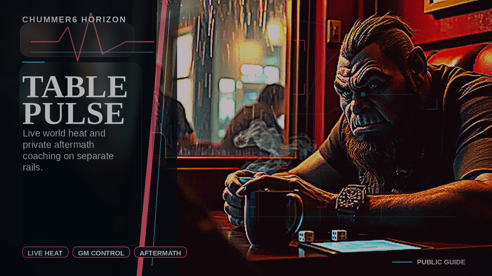

# Chummer6 At The Table

Start with the person at the table, not the system diagram. Chummer6 is strongest when a player can build a runner, understand the choices, give that runner a past, and then watch the campaign remember the consequences without stealing authority from the GM.

## In One Sentence

Chummer6 turns live table pressure, between-session faction motion, and public-safe world fallout into one governed play loop where the GM stays in charge and every meaningful action leaves a receipt.

## Where It Fits

Use this as the presentation story for the workbench plus campaign layer. Some surfaces are live and some are target shape; the guide keeps that boundary visible without making the reader decode internal release evidence.

## What Belongs Where

Chummer6 should read like one product with a strong core and a few ambitious expansion bets. If a user needs it to build, understand, run, remember, or return to a campaign, it belongs in the product story. The future shelf is only for the larger bets that still need distance from today’s download.

The core story stays anchored in Workbench, ALICE, Origin Dossier, NEXUS-PAN, Ready for Tonight, Runner Passport, Knowledge Fabric, and Table Pulse and GM Cockpit. Those are the surfaces that make Chummer feel useful before it feels ambitious.

Keep Karma Forge, Black Ledger, Runbook Press and Creator OS, Community Hub and Jackpoint, and Runsite, Ghostwire, and Anarchy on the future shelf for now. They matter, but they should not be the first burden on a new visitor.

A few labels should stay quiet: Onramp, Quicksilver as a headline Horizon, and Local Co-Processor as a public promise. They are starter help, navigation polish, or infrastructure, so the app should absorb them instead of selling them as separate ideas.

## Why You Would Open This

Table Pulse is the live pressure-and-response system for Chummer6.

It turns high-heat moments at the table into bounded reaction packets, governed player
follow-up, faction movement, and public-safe world fallout. The important rule is that the
system is dramatic without becoming fake authority:

- the GM remains final authority
- all external reactions are receipt-backed
- all public fallout is public-safe and approval-gated
- media tools may dramatize or suggest, but they do not become truth on their own

## How It Changes The Table

The best version reads as one connected play loop, not as separate modules:

1. **Table Pulse Core**: heat domains, thresholds, recipient packets, GM adjudication.
2. **Living World Engagement**: inbox, rumor market, standing orders, Runner Passport.
3. **Remote Reaction And Opt-Out Safety**: quiet hours, suppression record, consent defaults, remote mini-games.
4. **Pulse Director Control Surface**: GM cockpit, pressure economy, after-action projection, review suggestions.
5. **Player-Facing Action Layer**: sharp player action cards, stronger Passport framing, faction role paths, opposition clocks, living newsroom framing.

## Product Scenes

### Table Pulse Live Pressure

Table Pulse is the live pressure rail: a GM-governed action board that turns heat into bounded reactions, receipts, and public-safe fallout.

### ALICE Origin Dossier

Origin Dossier and ALICE bring a user-first lane into the stack: approved canon, grounded build help, and derivative dossier media on one governed rail.

## Watch The Scenes

- [Chummer6 flagship promo](https://chummer.run/media/promo/chummer6-flagship-promo.mp4) - Quick overview with narration. [Captions](https://chummer.run/media/promo/chummer6-flagship-promo.vtt).
- [TABLE PULSE 90-second deep dive](https://chummer.run/media/horizons/table-pulse-90s-deepdive.mp4) - Deep dive with narration. [Captions](https://chummer.run/media/horizons/table-pulse-90s-deepdive.vtt).
- [ALICE 90-second deep dive](https://chummer.run/media/horizons/alice-90s-deepdive.mp4) - Deep dive with narration. [Captions](https://chummer.run/media/horizons/alice-90s-deepdive.vtt).
- [Chummer6 product threads promo](https://chummer.run/media/promo/all-horizons-90s-magicfit-promo.mp4) - Product-thread overview with updated narration. [Captions](https://chummer.run/media/promo/all-horizons-90s-magicfit-promo.vtt).

## Video And Narration

Videos should feel authored and cinematic, but they still explain the product rather than performing as evidence. Only narrated, captioned clips belong in this reader-facing list.

What stays visible:

- use clear voice direction and cinematic narration for public scenes
- keep captions beside every linked video
- treat origin, ALICE, Table Pulse, and product-thread videos as explanation surfaces
- keep production labels out of the reader-facing story

What stays out of the pitch:

- claim a video has narration when the local file has no audio stream
- turn captions, logs, or production labels into the product pitch
- let a rendered scene become rules or release truth

## Downloads And Support Should Feel Boring

Release, updater, Arch/CachyOS packaging, account claiming, and instant help are maintenance lanes. They should make the product feel dependable without becoming another branded surface a new visitor has to decode.

What a user should be able to rely on:

- Windows and Linux are the primary public desktop lanes.
- Arch and CachyOS users get an AUR-compatible source sidecar for the same Linux build.
- Stable and nightly remain visibly separate, with a predictable morning publish cadence when a build is needed.
- A downloaded copy can be claimed online; account linking should feel like claiming your copy, not like a detour through a website.
- Instant help starts with short text, optional show-me video, and guided repair before escalation.

Keep these as maintenance lanes:

- download catalog
- AUR sidecar
- auto-updater
- install-link callback
- account claim
- instant support video library
- EA channel messaging

Do not present them as:

- a Horizon
- an internal audit trail
- a release ceremony
- an automation showcase

## User-First Entry Arc

The flagship story no longer starts only with table heat. A player can begin with a grounded origin dossier, approve canon, let ALICE use that canon as bounded build-help context, and then carry that identity into Passport, player action cards, and the living-world stack.

1. A player starts from Origin Dossier instead of facing a cold chargen sheet.
2. Approved canon freezes a stable narrative spine before downstream media regenerates.
3. ALICE uses the approved canon later as bounded context for build help, rules coach follow-up, and GM-steered tradeoff explanation.
4. Table Pulse, Runner Passport, and the living newsroom then make that runner feel present in a governed city instead of trapped in a one-session character form.

What stays trustworthy:

- approved origin canon may shape later ALICE suggestions
- GM gimmicks and allowances may steer narrative context without becoming auto-applied mechanics
- media packets derive from canon and receipts, not the other way around
- ALICE remains advisory and explainable even when the origin lane is rich and cinematic

## Origin Dossier And ALICE

Origin Dossier should now read as a flagship base feature: a player enters Chummer as a runner with causes, debts, people, scars, secrets, and unfinished consequences. ALICE keeps that story connected to rules explanation without letting prose silently mutate build truth.

A player should leave this lane with:

- origin draft and canon approval
- blank-state start and finished-runner additive entry points
- bundle root and derivative dossier media outputs
- voice-selection posture before audiobook packet generation
- bounded GM gimmick steering as advisory context
- later ALICE follow-up that references approved canon instead of inventing a new story spine

ALICE keeps the line tight by doing the following:

- ALICE owns the native desktop workbench for Build Help, Rules Coach, and Origin Dossier.
- Origin Dossier may start before chargen or from an already-finished runner without forcing mechanics back into edit mode.
- The approved origin canon feeds later ALICE explanations about tradeoffs, upgrades, and risk.
- GM allowances may appear in ALICE context and output, but they must not silently rewrite mechanics.
- Narration lanes should expose voice posture as an explicit user choice, not an invisible provider default.
- The lane is strongest when narrative continuity and rules explanation stay on the same governed rail.

That still does not mean:

- origin prose becomes mechanical truth by itself
- downstream portrait or video providers become rules authority
- ALICE is an autonomous build oracle

## GM Cockpit And Steering

GM Cockpit is the calm authority surface for steering Table Pulse, origin-dossier context, remote reactions, and public-safe fallout without turning a maintenance list into the product experience.

A GM should be able to trust these rails immediately:

- pulse policy and heat thresholds
- recipient reasoning, quiet-hours, mute, and opt-out posture
- GM allowances and gimmicks as explicit advisory context
- mini-game card source, chosen response, and proposed consequence
- public-safe release controls before any newsroom or public map projection
- receipt trail, override reason, and what remains manual review

From origin story to table call, the intended flow is:

1. GM steer may come before the origin story so it can shape tone, faction pressure, and allowed context.
2. The fixed SR4 troll decker test gimmick is a clinic contact that fronts restricted starter ware and one over-availability deck part.
3. ALICE may explain how that changes story pressure, legality posture, availability risk, and ware consequences.
4. The cockpit must keep those allowances advisory until a GM or player explicitly applies legal mechanics in the normal character workflow.

The visual language should read as:

- control room, action board, pressure map, and dossier drawer rather than admin table
- dense but scannable cards for heat, consent, receipt, and consequence state
- one strong primary action for adjudicate, approve, suppress, or request revision

That still does not permit:

- the GM cockpit is an autonomous simulator
- GM gimmicks auto-apply ware, money, gear, qualities, or availability exceptions
- public media can bypass private campaign posture or GM approval

## Hero Surfaces

### Player Action Cards

Player Action Cards is the quick player-facing response surface. It should feel urgent, tactical, dense but readable, and connected to the city, not just the session transcript. A reader should immediately grasp current signals, heat pressure, reaction windows, consequence lanes, and validated follow-through.

### Runner Passport

Runner Passport is the identity and continuity surface. It should feel personal, earned, faction-aware, and session-to-session. A reader should immediately grasp standing, role path, recent receipts, unlocked pressure lanes, and social and faction context.

### GM Cockpit

GM Cockpit is the authority surface. It should feel calm, sovereign, and readable under pressure. A reader should immediately grasp pulse policy, heat thresholds, recipient routes, mini-game approvals, quiet-hours and opt-out posture, and public-safe release controls.

### Living Newsroom

Living Newsroom is the public-safe consequence layer. It should feel cinematic, reactive, and consequence-driven. A reader should immediately grasp aftermath, faction motion, opposition clocks, and GM-approved public fallout.

It should never imply:

- private table truth leaked automatically
- the event was invented after the fact
- media became truth by itself

## Core Play Loop

### 1. Spark

A session event raises heat and creates a bounded pulse packet with typed context and recipient rules.

### 2. Reach

If policy and consent allow it, the pulse packet becomes player-facing or faction-facing delivery.

- inbox event
- player action card
- rumor item
- standing-order update
- remote reaction mini-game card

### 3. Response

Players or factions respond inside governed rails.

- advance Passport standing
- change a role path
- change faction heat
- nudge opposition clocks
- create after-action record

### 4. Fallout

Enough validated response can produce public-safe fallout.

- newsroom beat
- public-safe city consequence
- after-action brief

## The Moment It Should Create

A visitor should be able to picture an action board, not an admin form.

The effect comes from:

- seeing live pressure become playable
- watching a player action card cascade into faction consequences
- seeing Passport identity, role path, and city pressure connect
- watching a remote reaction mini-game end in a newsroom or public-safe city fallout beat

What would make it feel cheap:

- surveillance framing
- fake autonomous control
- public shaming scores
- empty engagement-platform language

## Hero Moment

The flagship version should let a reader immediately picture the best-case loop:

1. a run spikes heat and the GM approves a bounded pulse packet
2. a player receives an action card with one sharp risky choice and one safer choice
3. the choice resolves into Passport movement, faction pressure, and a receipt trail
4. the city later reflects that action through rumor, newsroom fallout, or public-safe consequence

## Promises We Should Not Break

- private campaigns default silent
- notifications are opt-in
- remote reactions are mini-games, not direct table mutation
- public projection requires public-safe GM-approved posture
- receipts outrank summaries
- BeHuman and Answerly stay adapter layers

## What Good Looks Like

Call the stack ready only when all of the following are true:

1. player action cards, Passport, and GM cockpit all exist as coherent product surfaces.
2. Remote reaction mini-games are real moments a player can understand and answer.
3. Inbox, rumor, order, and fallout lanes are receipt-backed.
4. Public-safe projection stays bounded by GM authority.
5. The system still feels fast, legible, and exciting for players.

## Related Surface

### ALICE

Current status: Shipped native desktop workbench with build help, rules coach, and origin-first chargen handoff.

Why a reader should care: This is the closest user-first entry into Chummer’s broader living-world stack.

Connection here: Origin Dossier creates approved canon; ALICE later uses that canon as bounded follow-up context for build help, rules coaching, and GM-steered explanation.

### Origin Dossier

Current status: Presentation-critical base feature for origin canon, dossier media, narration, and ALICE handoff.

Why a reader should care: It gives a casual visitor the immediate wow: this is not only a rules editor, it can make the life behind the stats matter.

Connection here: The approved origin becomes the narrative spine that ALICE, Runner Passport, and campaign follow-through can reference without inventing new truth.

## Where This Comes From

This guide follows the Chummer6 design canon and the public-guide source set. Treat it as a product guide, not as a rules engine or an unbounded release promise.

- TABLE_PULSE_LIVING_WORLD_STACK_20260523.md
- TABLE_PULSE_LIVING_WORLD_DRAMA6_BRIEF_20260523.md
- ORIGIN_DOSSIER_ALICE_GM_GIMMICK_E2E_GATE.md
- horizons/alice.md
